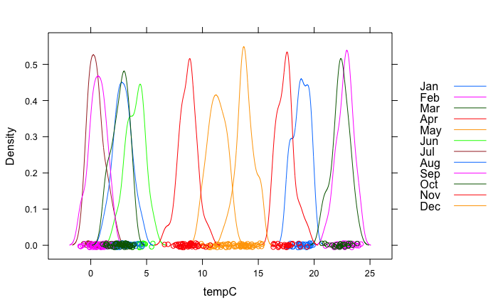
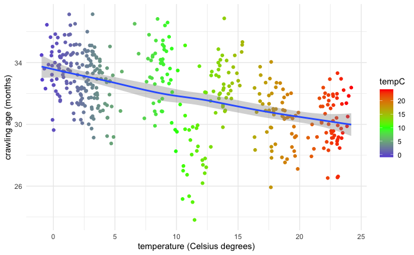

# Temperature and crawling age of infants in months


This is a simulated dataset based on `babies_crawl` <https://www.openintro.org/data/index.php?data=babies_crawl> which generates the crawling age of 414 infants along with the average outdoor temperature for plotting and analyses purposes. 

The source of original data:

J.B. Benson. Season of birth and onset of locomotion: Theoretical and methodological implications. In: Infant behavior and development 16.1 (1993), pp. 69-81. issn: 0163-6383. <https://www.sciencedirect.com/science/article/abs/pii/0163638393800298?via%3Dihub>

**Abstract**: Objective: To examine seasonal effect on motor development; in particular, the onset of crawling. Background: The acquisition of motor milestones demonstrates considerable age variation. Previous studies that examined the effect of season on motor development present inconsistent findings; geographical zone and climatic factors were among the identified factors. The present study was conducted in a Mediterranean climate. Method: Forty-seven full-term infants (25 boys and 22 girls), aged 7 months, were observed while playing in the home context, and the Alberta Infant Motor Scale (AIMS) was administered. Results: Infants who were born during the winter–spring (W) months started to crawl about 4 weeks earlier compared to infants born during the summer–autumn (S) months (t = 3.13, p = 0.003). Similarly, the AIMS total scores (t = 2.03, p = 0.05) and prone subscale (t = 2.19, p = 0.04) were significantly higher in W as compared to S born infants. Conclusion: The findings point to the involvement of season in the motor achievements of infants and suggest that aspects of the physical environment shape the experiences that contribute to developmental progress.

```r
library(ggplot2)
```





