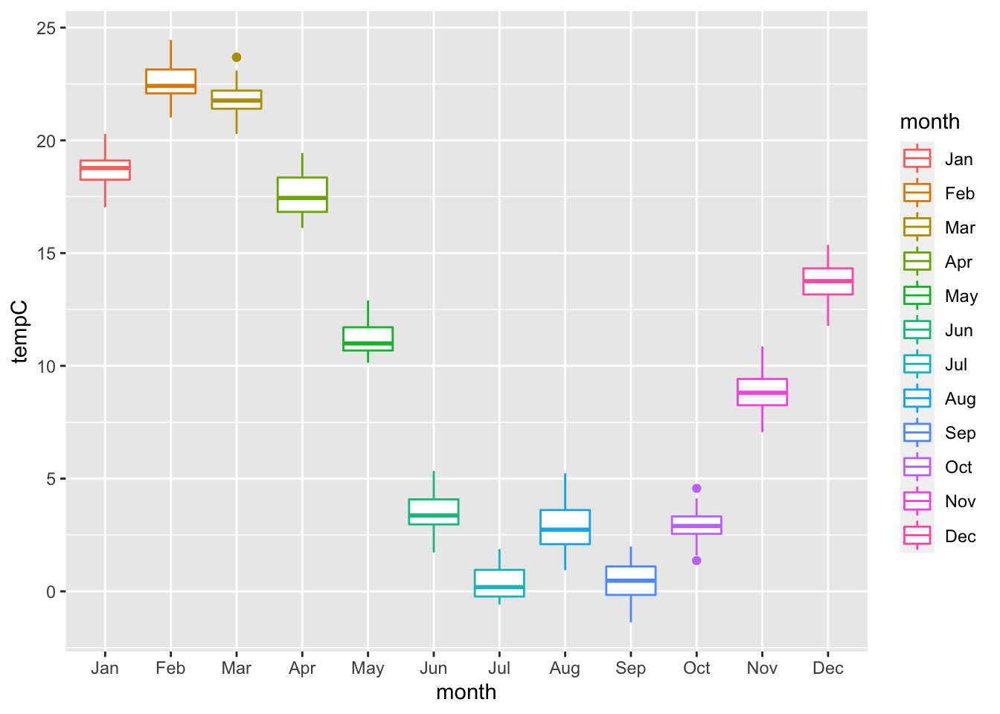
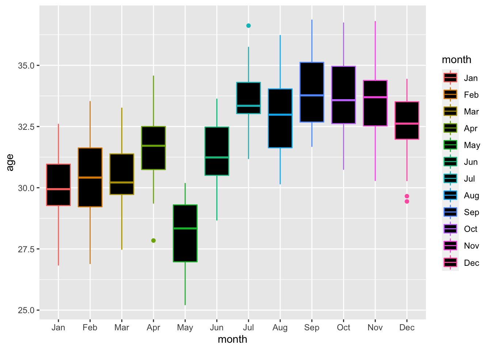
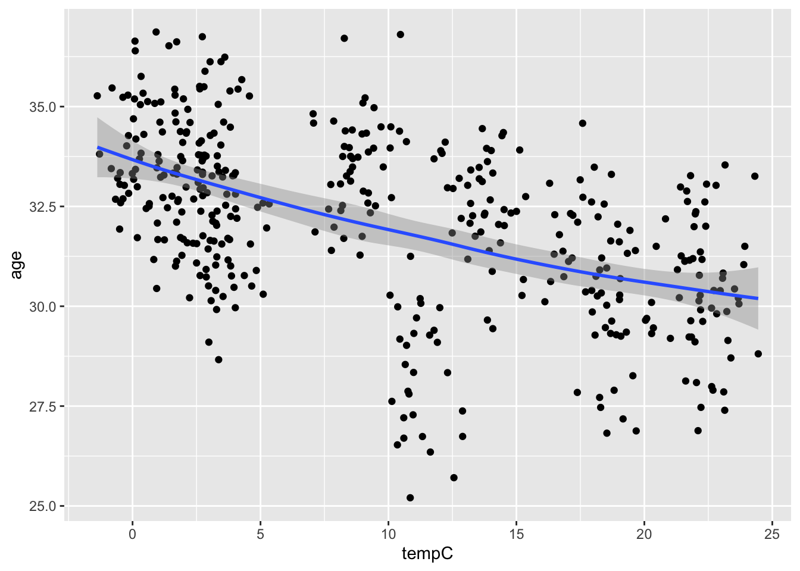

# Temperature and crawling age

This is a modified dataset from <https://www.openintro.org/data/index.php?data=babies_crawl> that generates the crawling age of 414 infants along with the average outdoor temperature for boxplot and correlational purposes.

